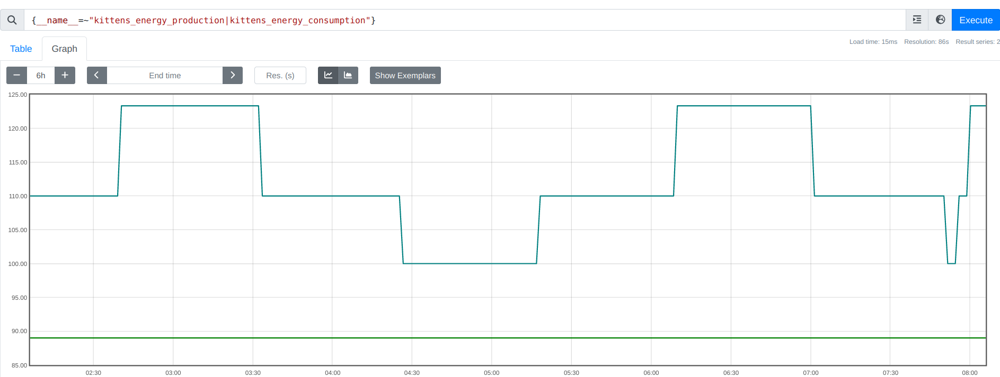

# Meow

Hi! So you have some [scientists](https://github.com/kitten-science/kitten-scientists) at your disposal, but what you're really hankering for are some *graphs*.

Look no further, the kittens got your back:



By the end of this document, you will have:
- A small userscript which collects kittens data and pushes it to...
- A small gateway server which receives said data and exposes it to...
- A Prometheus server which scrapes & graphs data

## Setup

This assumes you have docker and docker-compose, search the web for how to install those in your favourite operating system and flavour and all.

Compose things up:

```sh
$ docker-compose up -d
```

The images will be pulled, containers will be built, the whole shebang. Once all that's done, you will have two servers listening:

- http://localhost:9090 is the Prometheus server
- http://localhost:9091 is the analysts gateway

Now, head on over to [the bookmarklet](kittens-bookmarklet.js), and copy it into your console. The short script will send a delegation to talk to your kittens, asking for inventories and energy levels and pulling out happiness questionnaires and all that.

Visit [prometheus](http://localhost:9090) again, and enter a query like:

```
kittens_village_happiness
```

...or:

```
{__name__=~"kittens_resources_manpower|kittens_resources_faith"}
```

Tada! Pretty tables! Now hit the "Graph" tab for pretty graphs. See [Prometheus docs](https://prometheus.io/docs/prometheus/latest/querying/basics/) for some more info on querying.

## Oh no no graphs

If you're running kittens locally, and not on https://kittensgame.com , then no data will end up being ingested, and you'll be seeing scary errors in the console.

You can specify a `KITTENS_FRONTEND` environment variable to allow alternate frontends. For example, if your local kittens server is running on `http://localhost:4000`, you can specify (in [any of the supported ways](https://docs.docker.com/compose/environment-variables/set-environment-variables/)):

```
KITTENS_FRONTEND=http://localhost:4000
```

For example, in the `docker-compose`'s environment directive:

```
docker-compose.yml --- YAML
10 10       - 9090:9090
11 11   catflap:
12 12     build: .
.. 13     environment:
.. 14       - KITTENS_FRONTEND=http://localhost:4000
13 15     ports:
14 16       - 9091:9091
15 17
```

Load the server back up, things should be peachy.

Alternatively, you can set the value to `*` to allow *all* possible hosts.

## Teardown

In the same directory, you can:

```sh
$ docker-compose down
```

...to stop things and take a breath.

## Updates

The server just updated and you want in?

```sh
$ docker-compose down
$ docker-compose build
$ docker-compose up -d
```

And things should be good.
